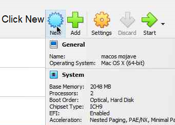
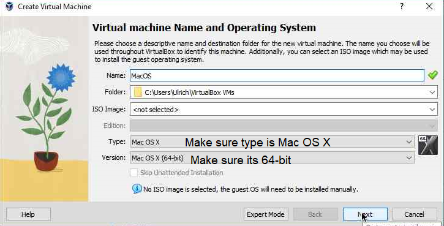
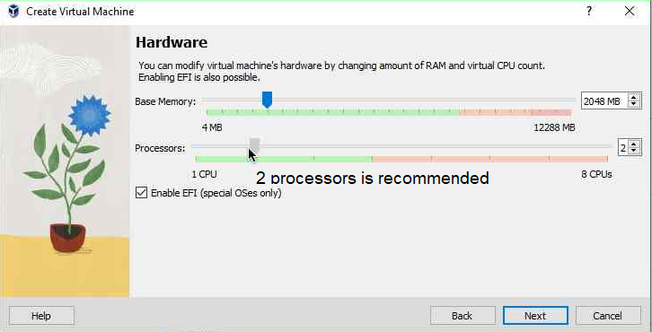
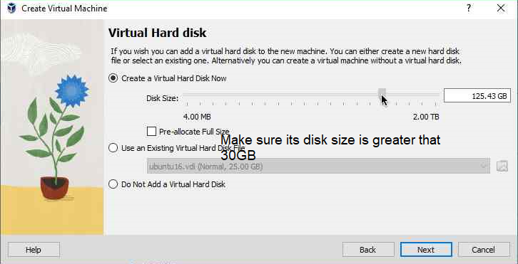
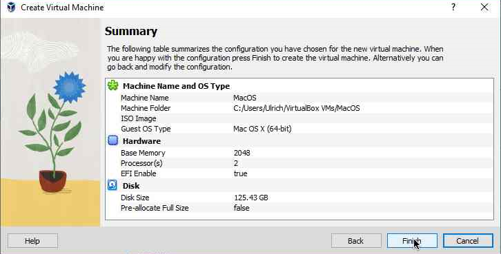
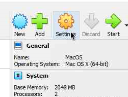
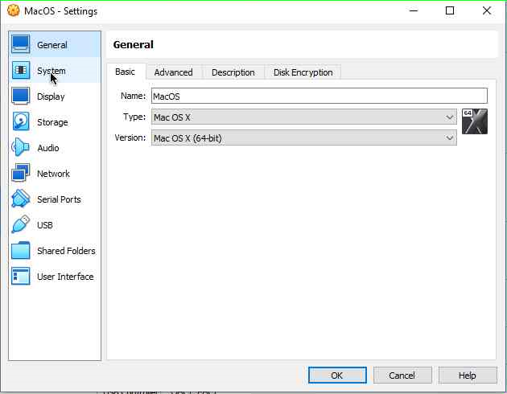
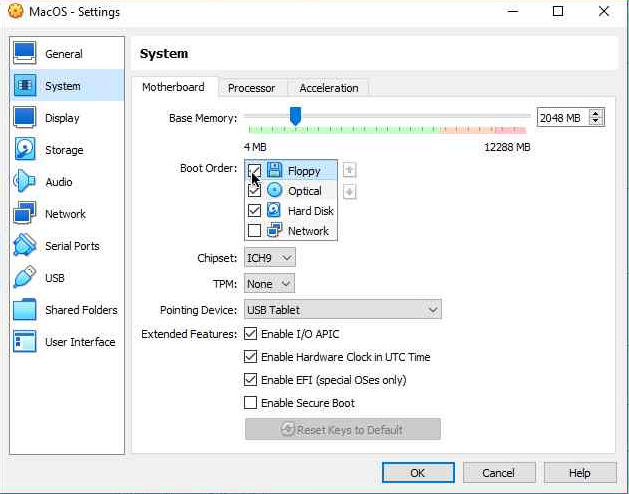
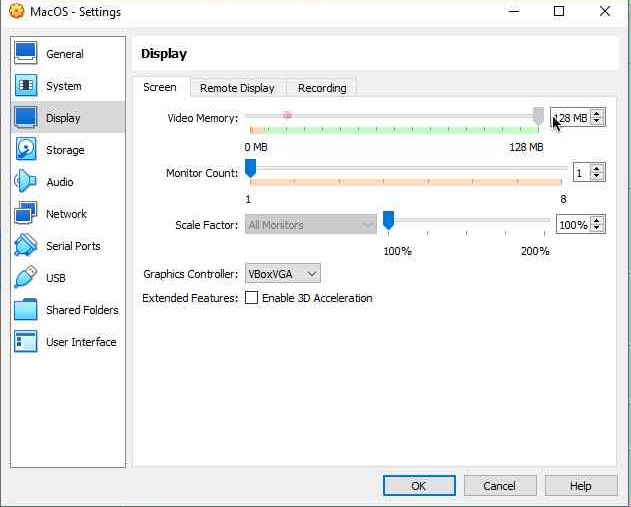
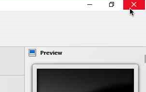

# OSX-in-VBox

## How it works
The `getdisk.bat` basically starts `fetch.py` using `python` and converts `dmg` into `img` to `vdi`  
And deletes the `dmg` and `img` image files  

The `setup.bat` patches some bugs to make it run macOS

## Setup

### Create a machine and select the type as `Mac OS X` and choose `Mac OS X (64-bit)` 
 
### Do not select an iso file because we will be using the `BaseSystem.vdi` that will be created later 
### Make sure EFI is enabled and 2 cores is recommended 
 
### Create a hard disk with a minimum size of 30GB 
 
 
### After creating machine, click settings
 
### In the `System` category deselect floppy in the `Boot Order`
 
 
### In the `Display` category set the `Video Memory` to 128mb
 
### After that close VirtualBox
 
### Edit `setup.bat` and change the `vbox` variable to locate where Virtualbox is installed and make sure the slashes is a backslash `\` (ignore this step if you installed VirtualBox to the default location) 
### After that, run `setup.bat` and type your VM name

## To Do List

- [ ] Diffrent Screen Sizes
